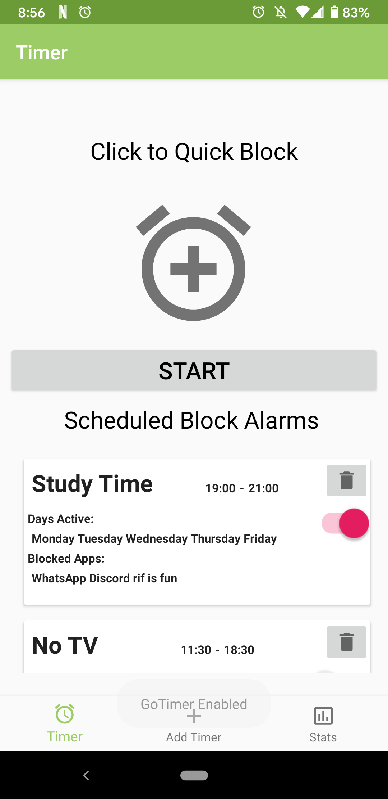

# GoTimer

GoTimer is a productivty boosting application that lets users block specified distracting phone applications for either a set duration of time or a scheduled time frame. Built utilizing a room database, live-data, broadcasts and alarms to let users track monthly subscriptions and receive notifications on the dates due. 

## Features
* Cutomizable GoTime Profiles
* Scheduled Blocking Sessions
* Select Any Distracting Phone App
* Quick Block Feature
* Count Down Focus Timer
* Count Down Focus Timer Widget
* Easy to Use!

## Screenshots

